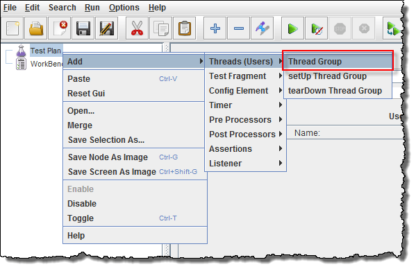
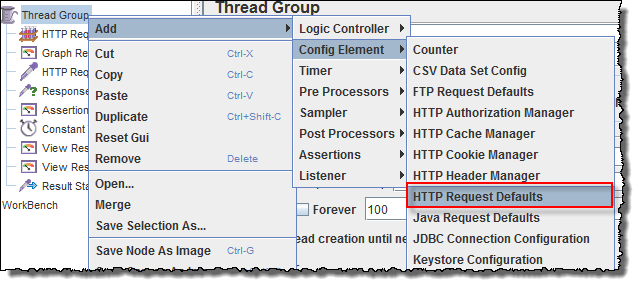
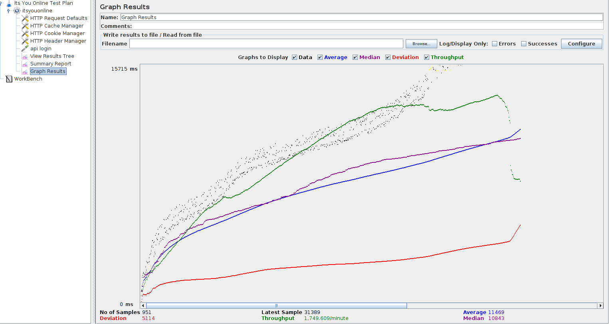

## Performance Test Plan with Jmeter

**Example: To be used as a template**

we are doing a performance analysis of itsyou.online for 1000 users

**Before testing the performance of target web application, we should determine-**

**Normal Load:** Average number of users visit your website
**Heavy Load:** The maximum number of users visit your website
**What is your target in this test?**

**Here is the roadmap of this practical example**

**Step 1) Add Thread Group**

1. Start JMeter
2. Select Test Plan on the tree
3. Add Thread Group
4. Right click on the Test Plan and add a new thread group: Add -> Threads (Users) -> Thread Group

In Thread Group control panel, enter Thread Properties as following:

1. Number of Threads: 100 (Number of users connects to target website: 100)
2. Loop Count: 10 (Number of time to execute testing)
3. Ramp-Up Period: 100

**The Thread Count and The Loop Counts are different.**

**Ramp-Up Period tells JMeter how long to delay before starting next user.**

For example, if we have 100 users and a 100 second Ramp-Up period, then the delay between starting users would be 1 second (100 users /100 seconds)

**Step 2) Adding JMeter elements**
Now we determine what JMeter elements in this test. The elements are

**HTTP request Default**
This element can be added by right-clicking on the Thread Group and selecting: Add -> Config Element -> HTTP Request Defaults.

In the HTTP Request Defaults control panel, enter the Website name under test (https://itsyou.online)

**HTTP Request**
Right-click on Thread Group and select: Add -> Sampler -> HTTP Request.

**In HTTP Request Control Panel**, the Path field indicates which URL request you want to send to the server.

For example, if you enter "api" in Path field. JMeter will create the URL request https://itsyou.online/api  to the server

If you keep  the Path field blank  JMeter will create the URL request https://itsyou.online to the server.

In this test, you keep the Path field blank to make JMeter create the URL request https://itsyou.online to the server.

**Step 3) Adding Graph result**

JMeter can show the test result in Graph format.

Right click Test Plan, Add -> Listener -> Graph Results

Step 4) Run Test and get the test result
Press Run button (Ctrl + R) on Toolbar to start the testing process. You will see the test result display on Graph at the real time.

The picture below presents a graph of a test plan, where we simulated 100 users who accessed on website

At the bottom of the picture, there are the following statistics, represented in colors:

1. Black: The total number of current samples sent.
2. Blue: The current average of all samples sent.
3. Red: The current standard deviation.
4. Green: Throughput rate that represents the number of requests per minute the server handled

**To analyze the performance of the web server under test, you should focus on 2 parameters**

1. Throughput
2. Deviation

The Throughput is the most important parameter. It represents the ability of the server to handle heavy load.  The higher the Throughput is, the better is the server performance.

The deviation is shown in red - it indicates the deviation from the average. The smaller the better.

**Here is the practical example**
[Practical Example 1](typical_example.md)

**For further detailed performance objectives and results**
[Performance Objectives](Performance_Objectives.md)
[Practical Example 2](practical_example2.md)
